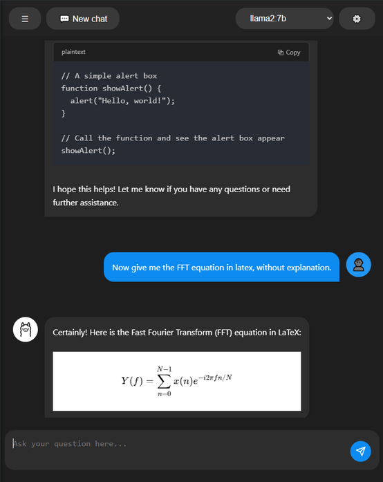

# smOllama

A lightweight web browser chatbot interface for Ollama models.

## Overview

smOllama is a lightweight chatbot interface designed specifically for Ollama language models. Built with plain HTML, CSS, and JavaScript, it offers a clean, efficient way to interact with your local Ollama models without the bloat of larger alternatives.

## Features

- **Instant Ollama integration**
- **Lightweight**: Possibly the smallest Ollama chat interface available.
- **No Dependencies**: Built with vanilla HTML, CSS, and JavaScript - no frameworks required
- **Markdown Support**: Markdown formatting, including bold, italics, and links.
- **LaTeX rendering** With Katex
- **Code blocks rendering** With Prism
- **Clean UI**: Simple, intuitive interface for seamless conversations
- **Fast Loading**: Minimal footprint means instant startup
- **Local Operation**: Works entirely with your local Ollama instance
- **Cross-Platform**: Works on any device with a modern web browser
- **Conversation history** with IndexedDB storage
- **Mobile-responsive design**
- **Real-time streaming**

## Getting Started

### Prerequisites

- A running Ollama instance with at least one model installed
- A modern web browser

### Installation  

#### Windows  
- Double-click the included `windows_start_server.bat` file to automatically start a server on port 80 and open smOllama.  
- Or manually start a server with: `npx live-server --port=80 public`

#### Other systems (Linux, macOS, etc.)  
- Simply run the command: `npx live-server --port=80 public`

You can also use any other web server of your choice (due to CORS restrictions, opening the file directly in a browser won't work).

## Configuration

smOllama can be configured by clicking the settings icon. Available options include:

- **Default Model Selection**: Choose which Ollama model to use for your conversations
- **System Message**: Set custom instructions or context that guide how the AI responds
- **Temperature**: Adjust the creativity level of responses (higher values produce more varied outputs)
- **Length of Context**: Control how much conversation history is retained and sent with each request
- **Export Conversation**: Save your current chat session for future reference or sharing

## Usage

1. Select your preferred Ollama model from the dropdown
2. Type your message in the input field
3. Press Enter or click the Send button
4. View the response with rendered Markdown and LaTeX

## Browser Compatibility

smOllama works with all modern browsers including:
- Chrome/Chromium
- Firefox
- Safari
- Edge

## Why smOllama?

Unlike many other Ollama chat interfaces, which rely on heavy frameworks or have large file sizes, smOllama focuses on minimal footprint while maintaining essential functionality. It's perfect for:

- Users with limited system resources
- Quick testing of Ollama models
- Embedding in other applications
- Learning how to build web interfaces for AI models

## Contributing

Contributions are welcome! Please feel free to submit a Pull Request.

## License

This project is available under a very permissive license. You are free to use, modify, and distribute it as you wish, with only one simple request:  

- Please keep the original author's name in the comments.  

No formal LICENSE file is required—just respect this minimal courtesy.
If needed, you can fork and apply your own license.
If you find this tool useful, you might consider [buying me a coffee](https://buymeacoffee.com/gunnm) to support my work.

## Acknowledgments

- Thanks to the Ollama team for creating a great local LLM platform
- Inspiration from other chat interfaces while focusing on minimalism
